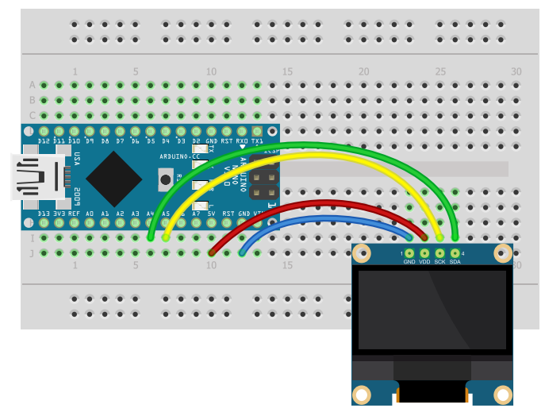

# Processing-ArduinoCOMTalk
Simple Talk Arduino and Computer via COM4 with UI (Processing)

В этом примере показана работа скетча на Processing'е и Arduino посредством COM порта: При запуске скетча, программа считывает нажатия клавиш клавиатуры компьютера и передаёт их в COM порт. Arduino, в свою очередь, отображает полученные данные на OLED экране.

### Для начала необходимо скачать Processing IDE:
> 1. Качаем версию под свою ОС: https://processing.org/download/
> 2. Распаковываем архив и запускаем
>
> *<i style="color:gray"> Я использовал этот видео-урок: <a href="https://youtu.be/2fs1tuUUJRM?list=PLgAbBhxTglwmVxDDC5TSYUI91oZ0LZQMw&t=147">тык</a></i>
> 

### Схема подключения Экрана:
- GND - GND
- VCC (VDD) - 5V
- SCL (SCK) - A5
- SDA - A4

### Прошивка Arduino:
> Для работы с OLED экраном я использовал библиотеку GyverOLED: <a href="https://github.com/GyverLibs/GyverOLED">тык</a>

Загружаем скетч [sketch_oled_display](ArduinoSketch\sketch_oled_display\sketch_oled_display.ino)

### Запуск программы

Запускаем через Processing IDE скетч [Processing_Sketch.pde](Processing_Sketch\Processing_Sketch.pde).
> По умолчанию там установлен порт **COM4**. Если он у вас другой, то замените в `10`й строке на нужный порт. **Все доступные порты отобажаются в консоли при запуске программы**.
